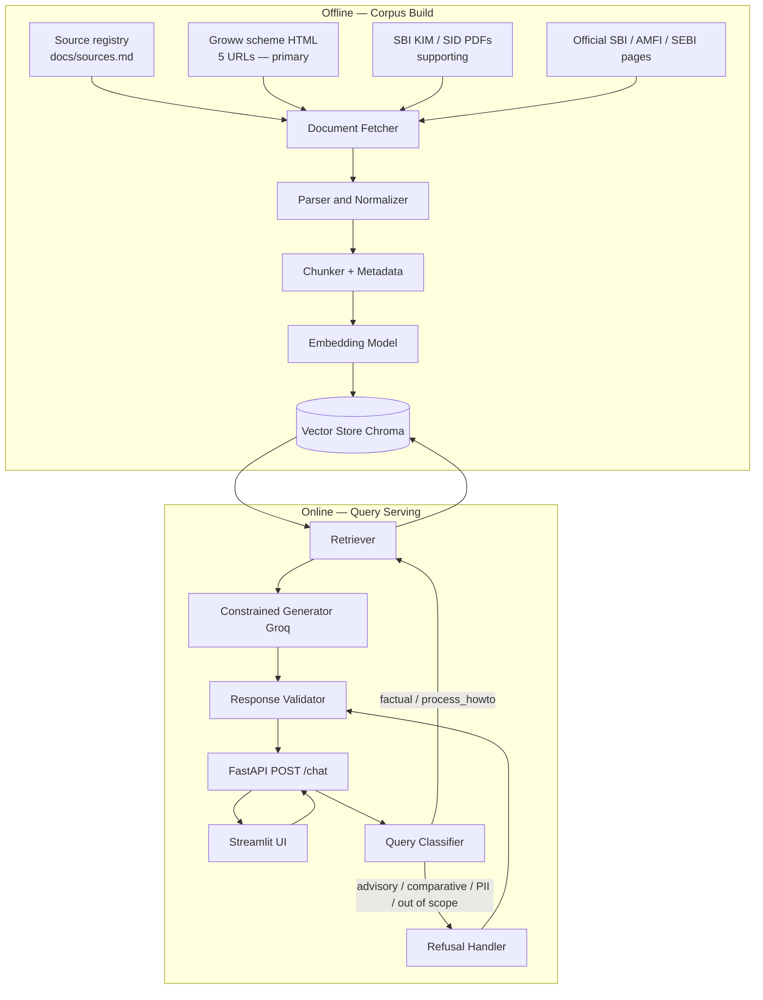
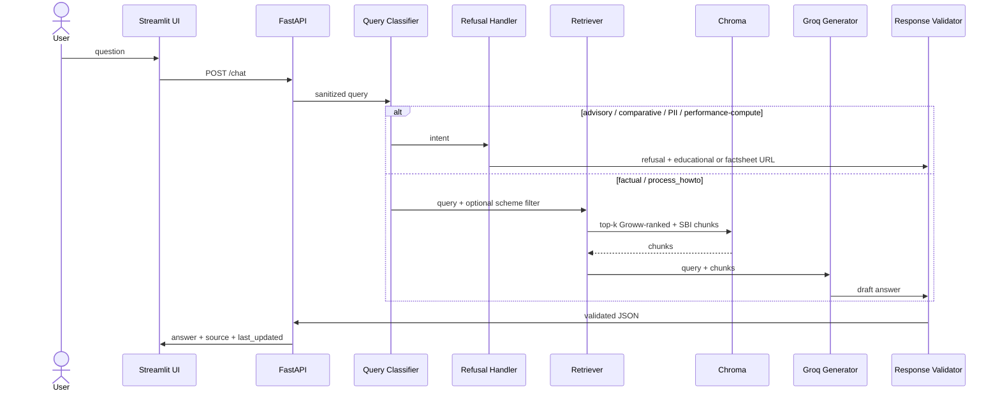

# Architecture: Mutual Fund FAQ Assistant (Facts-Only RAG)

## 1. Purpose

This document is the system architecture for a **facts-only mutual fund FAQ assistant**. Product context is **Groww**. AMC scope is **SBI Mutual Fund**. Related brief: [`problemStatement.md`](./problemStatement.md).

**Groww scheme URLs are the primary source.** Dual ingest still includes SBI documents, but Groww is first in the registry, first in ingest, first in retrieval ranking, and the default citation.

The corpus is built from:

1. **Primary — Groww scheme pages** — the five public scheme URLs in the problem statement (HTML snapshots).
2. **Supporting — SBI Mutual Fund KIM and SID PDFs** — the ten files already under `docs/corpus/kim/` and `docs/corpus/sid/`.
3. **Supporting — additional official pages** (SBI factsheets, TER hub, AMFI, SEBI) so the published source list reaches **15–25 URLs**.

The LLM does **not** browse the live web at answer time. It only sees retrieved chunks from this closed corpus.

Design principle: **accuracy over intelligence**. Retrieve published facts, format a short answer, refuse advice. Do not compute returns, compare schemes, or recommend buy/sell.

---

## 2. Goals and non-goals

### 2.1 Goals

| Goal | How architecture supports it |
| --- | --- |
| Factual answers only | Query classifier + constrained generator + response validator |
| Dual ingest with **Groww primary** | Document Fetcher runs the **Groww HTML adapter first**, then the **SBIMF PDF adapter** |
| One clear citation | Chunk metadata stores a public `url`; validator enforces exactly one `Source:` |
| ≤ 3 sentences + last-updated footer | Response contract checked before return |
| No PII | Classifier + refusal; UI/API accept only `question` |
| Minimal UI | Welcome, three examples, disclaimer |

### 2.2 Non-goals

- Investment advice, suitability, or “should I buy/sell”
- Return calculation or performance comparison (link official factsheet only)
- Multi-AMC coverage (exactly **one AMC**: SBI Mutual Fund)
- Login, KYC, account lookup, or generating statements (public “how to download” only)
- Blogs, news, Moneycontrol, Value Research, other AMC sites
- Groww **app screenshots**, logged-in dashboards, or backend systems as sources
- Citing a local filesystem path (`docs/corpus/...pdf`) in the UI

---

## 3. Scope

### 3.1 AMC and schemes

**AMC:** SBI Mutual Fund — `https://www.sbimf.com/`

**Five schemes.** Each scheme is ingested from a **primary Groww HTML page** and supporting SBI KIM + SID PDFs.

| Canonical scheme name | Groww ingest URL | Local KIM PDF | Local SID PDF |
| --- | --- | --- | --- |
| SBI Large Cap Fund (Direct Growth) | https://groww.in/mutual-funds/sbi-large-cap-direct-plan-growth | `docs/corpus/kim/kim---sbi-large-cap-fund-(formerly-known-as-bluechip-fund).pdf` | `docs/corpus/sid/sid---sbi-large-cap-fund-(formerly-known-as-bluechip-fund).pdf` |
| SBI Flexicap Fund (Direct Growth) | https://groww.in/mutual-funds/sbi-flexicap-fund-direct-growth | `docs/corpus/kim/kim---sbi-flexicap-fund.pdf` | `docs/corpus/sid/sid---sbi-flexicap-fund.pdf` |
| SBI ELSS Tax Saver Fund (Direct Growth) | https://groww.in/mutual-funds/sbi-elss-tax-saver-fund-direct-growth | `docs/corpus/kim/kim---sbi-elss-tax-saver-fund-(formerly-known-as-sbi-long-term-equity-fund).pdf` | `docs/corpus/sid/sid---sbi-elss-tax-saver-fund.pdf` |
| SBI Contra Fund (Direct Growth) | https://groww.in/mutual-funds/sbi-contra-fund-direct-growth | `docs/corpus/kim/kim---sbi-contra-fund.pdf` | `docs/corpus/sid/sid---sbi-contra-fund.pdf` |
| SBI Small Cap Fund (see naming note) | https://groww.in/mutual-funds/sbi-small-midcap-fund-direct-growth | `docs/corpus/kim/kim---sbi-small-cap-fund.pdf` | `docs/corpus/sid/sid---sbi-small-cap-fund.pdf` |

**Naming check (confirmed 2026-08-24):** Groww slug `sbi-small-midcap-fund-direct-growth` is the same scheme as **SBI Small Cap Fund** (formerly SBI Small & Midcap Fund). Groww page title is SBI Small Cap Fund Direct Growth; local PDFs are Small Cap. **Merge tags:** use canonical `SBI Small Cap Fund` / `sbi_small_cap` for both Groww and SBI chunks. Still cite the Groww URL as registered.

**Alias map (safe):** Bluechip → Large Cap; Long Term Equity → ELSS Tax Saver; Small & Midcap / Small Midcap → Small Cap. Apply during parse, not at citation time.

### 3.2 Ingest allowlist (hosts)

| Host | Role in ingest |
| --- | --- |
| `groww.in` | **Primary.** **Only** the five scheme paths above. No Groww blog, news, or other funds. |
| `sbimf.com` | Supporting: local KIM/SID PDFs (cite official offer-document URL), factsheets, TER, investor FAQs |
| `amfiindia.com` | Education + refusal links (riskometer, MF basics) |
| `sebi.gov.in` / `investor.sebi.gov.in` | Education + refusal links |

Do **not** ingest: aggregator blogs, other AMCs, or arbitrary Groww articles.

### 3.3 Question types in scope

- Expense ratio / TER  
- Exit load  
- Minimum SIP / lumpsum  
- ELSS statutory lock-in  
- Riskometer and benchmark (as published)  
- How to download capital-gains / tax / account statements (public process only)

### 3.4 Question types to refuse

- Buy / sell / hold recommendations  
- “Which fund is better” (comparative analytics)  
- Return numbers computed or compared by the assistant  
- Personal tax advice beyond linking official process pages  
- Any request that includes PII  

---

## 4. Dual-source ingest strategy

Groww pages and SBI PDFs are both ingested. **Groww is primary; SBI is supporting.**

| Dimension | Groww HTML (**primary**) | SBIMF KIM/SID PDF (**supporting**) |
| --- | --- | --- |
| Why ingest | Problem-statement scheme landing points; compact product snapshot (TER, min SIP, exit load, risk as shown on the page) | Fill-in when Groww text lacks a field (lock-in slabs, SID definitions, official TER language) |
| How ingested | HTTP GET **first** → save HTML under `docs/corpus/groww/`. Index is incomplete if any of the five fetches fail. | Register files already on disk after Groww fetch; no re-download required |
| What users see as `Source:` | The Groww scheme URL (**default**) | Matching **sbimf.com** SID/KIM or hub URL — never `file://` or `docs/corpus/...` |
| Citation rank | **1 (primary)** | **2 (supporting)** |

**Conflict rule:** if Groww and SBI chunks disagree on the same field, the generator must prefer **Groww** and cite the Groww scheme URL. Use SBI only when the retrieved Groww chunks do not contain the field. Still emit **one** source link.

**Performance rule:** do not quote Groww return charts or compute CAGR. Point to the official factsheet (or SBI returns page) only.

---

## 5. High-level architecture

Two pipelines: **offline corpus build** and **online query serving**.



---

## 6. Offline — Corpus Build

### 6.1 Source registry (`docs/sources.md` / CSV)

Every ingest item is one registry row. Target **15–25** public URLs. **Ingest from `local_path`. Cite `url`.**

Row schema:

| Field | Description |
| --- | --- |
| `source_id` | Stable id, e.g. `groww-flexicap`, `kim-elss`, `sid-contra` |
| `url` | Public citation URL |
| `publisher` | `GROWW` \| `SBI` \| `AMFI` \| `SEBI` |
| `doc_type` | `groww_scheme` \| `KIM` \| `SID` \| `factsheet` \| `TER` \| `FAQ` \| `statement_guide` \| `education` |
| `scheme` | Canonical scheme name, or `shared` |
| `local_path` | Snapshot path used at ingest |
| `retrieved_on` | ISO date of fetch or PDF file date recorded at ingest |
| `priority` | Integer citation rank (**1 = Groww scheme pages**, 2 = SBI KIM/SID/factsheet/TER, 3 = AMFI/SEBI) |

### 6.2 Planned 20-source inventory (within 15–25)

**Groww (5) — primary; ingest HTML first (`priority=1`)**

| # | `source_id` | `url` |
| ---: | --- | --- |
| 1 | `groww-large-cap` | https://groww.in/mutual-funds/sbi-large-cap-direct-plan-growth |
| 2 | `groww-flexicap` | https://groww.in/mutual-funds/sbi-flexicap-fund-direct-growth |
| 3 | `groww-elss` | https://groww.in/mutual-funds/sbi-elss-tax-saver-fund-direct-growth |
| 4 | `groww-contra` | https://groww.in/mutual-funds/sbi-contra-fund-direct-growth |
| 5 | `groww-small-midcap` | https://groww.in/mutual-funds/sbi-small-midcap-fund-direct-growth |

**SBI KIM/SID (10) — supporting (`priority=2`); ingest local PDFs; cite offer-document hub or scheme PDF URL on sbimf.com**

Hub for all ten: https://www.sbimf.com/offer-document-sid-kim  

Where a stable `sbimf.com/docs/default-source/...pdf` URL exists, prefer that as `url`. Otherwise cite the hub plus scheme name in chunk `section_title` (the UI still shows **one** URL).

| # | `source_id` | Local ingest path |
| ---: | --- | --- |
| 6 | `kim-large-cap` | `docs/corpus/kim/kim---sbi-large-cap-fund-(formerly-known-as-bluechip-fund).pdf` |
| 7 | `sid-large-cap` | `docs/corpus/sid/sid---sbi-large-cap-fund-(formerly-known-as-bluechip-fund).pdf` |
| 8 | `kim-flexicap` | `docs/corpus/kim/kim---sbi-flexicap-fund.pdf` |
| 9 | `sid-flexicap` | `docs/corpus/sid/sid---sbi-flexicap-fund.pdf` |
| 10 | `kim-elss` | `docs/corpus/kim/kim---sbi-elss-tax-saver-fund-(formerly-known-as-sbi-long-term-equity-fund).pdf` |
| 11 | `sid-elss` | `docs/corpus/sid/sid---sbi-elss-tax-saver-fund.pdf` |
| 12 | `kim-contra` | `docs/corpus/kim/kim---sbi-contra-fund.pdf` |
| 13 | `sid-contra` | `docs/corpus/sid/sid---sbi-contra-fund.pdf` |
| 14 | `kim-small-cap` | `docs/corpus/kim/kim---sbi-small-cap-fund.pdf` |
| 15 | `sid-small-cap` | `docs/corpus/sid/sid---sbi-small-cap-fund.pdf` |

**Shared official pages (5) — supporting (`priority=3`); fetch HTML (and factsheet PDFs when added)**

| # | `source_id` | `url` |
| ---: | --- | --- |
| 16 | `sbi-home` | https://www.sbimf.com/ |
| 17 | `sbi-sid-kim-hub` | https://www.sbimf.com/offer-document-sid-kim |
| 18 | `sbi-factsheets-hub` | https://www.sbimf.com/factsheets/ |
| 19 | `sbi-ter` | https://www.sbimf.com/total-expense-ratio/ |
| 20 | `amfi-investor` | https://www.amfiindia.com/investor |

Optional extras (if still under 25): SEBI riskometer (`https://investor.sebi.gov.in/riskometer.html`), SBI statement/tax-document investor pages, and **one factsheet PDF per scheme** downloaded from the factsheets hub into `docs/corpus/factsheets/`.

**Count toward 15–25:** 5 Groww URLs + 10 PDF citations (sbimf.com, not local paths) + shared hubs = **20** before optional factsheets.

### 6.3 Document Fetcher

Run adapters in this order. Groww is required for a complete index.

| Adapter | Behaviour |
| --- | --- |
| **Groww HTML (primary, first)** | `GET` the five allowlisted scheme URLs. Persist HTML to `docs/corpus/groww/{scheme}.html`. Record `retrieved_on`. No site-wide crawl. Respect robots; polite delay. **Fail the build if any of the five Groww fetches fail.** |
| **SBIMF PDF (supporting)** | Walk `docs/corpus/kim/*.pdf` and `docs/corpus/sid/*.pdf`. Join to registry by filename. Do not fail ingest if HTTP re-download is unavailable. |
| **Official HTML (supporting)** | Fetch SBI/AMFI/SEBI registry rows into `docs/corpus/shared/` (and factsheet PDFs into `docs/corpus/factsheets/`). |

Reject any host outside the allowlist. Groww fetch is **public pages only** — no authenticated session cookies.

### 6.4 Parser and Normalizer

| Input | Parse |
| --- | --- |
| Groww HTML (**parse first**) | BeautifulSoup: main scheme body only. Extract labelled facts when present (expense ratio, min SIP, min lumpsum, exit load, riskometer, AUM, category). Drop nav, ads, “people also viewed”, comments, related-fund carousels. |
| SBI PDF (supporting) | pdfplumber (preferred for tables) with pypdf fallback. Extract text + tables for exit-load slabs, minimum investment, lock-in, TER language, benchmark, riskometer. |
| Official HTML | Main article / table body only. |

Normalization:

- Unicode cleanup, collapse whitespace, keep table rows as ` \| `-joined text.  
- Apply safe scheme aliases (Bluechip, Long Term Equity).  
- Do **not** alias Small Midcap ↔ Small Cap until confirmed.  
- Stamp every parsed document with `publisher`, `doc_type`, `url`, `retrieved_on`.

### 6.5 Chunker + Metadata

Chunk **Groww pages first**, then KIM/SID. Prefer **heading-aware** splits on KIM/SID section titles (Exit Load, Expense Ratio, Minimum Application Amount, Lock-in, Benchmark, Riskometer, Investment Objective).

Fallback: ~500–800 tokens, 10–15% overlap.

Every chunk:

```json
{
  "chunk_id": "kim-elss#lock-in#0",
  "text": "...",
  "scheme": "SBI ELSS Tax Saver Fund",
  "doc_type": "KIM",
  "publisher": "SBI",
  "priority": 2,
  "section_title": "Lock-in period",
  "url": "https://www.sbimf.com/offer-document-sid-kim",
  "local_path": "docs/corpus/kim/kim---sbi-elss-tax-saver-fund-(formerly-known-as-sbi-long-term-equity-fund).pdf",
  "retrieved_on": "2026-08-24"
}
```

Groww example:

```json
{
  "chunk_id": "groww-flexicap#expense#0",
  "scheme": "SBI Flexicap Fund",
  "doc_type": "groww_scheme",
  "publisher": "GROWW",
  "priority": 1,
  "section_title": "Expense ratio / min SIP snapshot",
  "url": "https://groww.in/mutual-funds/sbi-flexicap-fund-direct-growth",
  "local_path": "docs/corpus/groww/sbi-flexicap-fund-direct-growth.html",
  "retrieved_on": "2026-08-24"
}
```

`local_path` is ingest-only. The generator and UI never receive it as a citation.

### 6.6 Embedding Model and Vector Store

- Embeddings: local `sentence-transformers` (same model at ingest and query).  
- Store: Chroma under `data/chroma/`.  
- Metadata filters: `scheme`, `publisher`, `doc_type`, `priority`.  
- Optional hybrid: keyword boost for scheme names and tokens such as `exit load`, `SIP`, `lock-in`, `TER`.

### 6.7 Current inventory vs target

| Status | Count | What |
| --- | ---: | --- |
| On disk | 10 | SBI KIM + SID PDFs (supporting) |
| To fetch (required) | 5 | Groww scheme HTML (**primary**) |
| To fetch | 5+ | Factsheets, TER HTML, AMFI/SEBI, statement/tax guides |

---

## 7. Online — Query Serving

### 7.1 Web UI (Streamlit)

- Title + welcome: **facts from Groww scheme pages** (SBI KIM/SID as supporting corpus)  
- Visible disclaimer: **“Facts-only. No investment advice.”**  
- Three example questions (expense ratio, ELSS lock-in, min SIP)  
- Answer + one citation link + `Last updated from sources:`  
- No login, KYC, PAN, phone, or email fields  

### 7.2 API

`POST /chat` with `{ "question": "..." }` only.

Pipeline: classify → refuse **or** retrieve → generate → validate.

### 7.3 Query Classifier

Rules-first (keywords + PII regex). Optional light LLM confirm for ambiguous wording. **PII and advisory stay rules-first.**

| Intent | Action |
| --- | --- |
| `factual` | Retriever → Constrained Generator |
| `process_howto` | Retriever filtered to statement/tax-guide + AMFI/SBI process chunks |
| `performance` | Refusal Handler; cite factsheet / official returns page — no math |
| `advisory` | Refusal + AMFI/SEBI educational link |
| `comparative` | Refusal Handler |
| `pii` | Refusal; do not persist the raw message |
| `out_of_scope` | Refusal; point at in-scope examples |

PII patterns (detect, do not store): PAN, Aadhaar, account numbers, OTP, email, phone.

### 7.4 Refusal Handler

No retrieval for advice. Polite facts-only limitation + **one** educational or factsheet URL. Output still goes through the Response Validator (≤ 3 sentences, footer, disclaimer).

### 7.5 Retriever

1. Detect mentioned scheme (aliases included). Filter metadata `scheme` when confident.  
2. Query **both** Groww and SBI chunks (no publisher-only search for factual scheme questions).  
3. Top-k ≈ 4–6. Prefer a mix: **at least one Groww (`priority=1`) chunk** when a named in-scope scheme matches.  
4. Re-rank by `priority` (**Groww first**) then similarity.  
5. Below score threshold: “not in corpus” + **that scheme’s Groww URL**. No invented numbers.

### 7.6 Constrained Generator (Groq)

- Context = retrieved chunks only. No tools, no live web.  
- Facts only; no advice, comparisons, or return math.  
- ≤ 3 sentences.  
- Choose **one** `url` from chunk metadata using citation preference (§8). **Default is Groww.**  
- If Groww and SBI disagree, prefer **Groww** and cite the Groww scheme URL. Use SBI only when Groww chunks lack the field.

### 7.7 Response Validator

| Check | On fail |
| --- | --- |
| ≤ 3 sentences | Truncate or regenerate once |
| Exactly one `Source:` | Insert URL from chosen chunk |
| Host in allowlist (`groww.in`, `sbimf.com`, `amfiindia.com`, `sebi.gov.in`, `investor.sebi.gov.in`) | For factual scheme Qs, replace with the scheme’s **Groww URL**; refusals may use AMFI/SEBI |
| `Last updated from sources:` | Append cited chunk `retrieved_on` |
| No PII echoed | Redact + refuse |
| No invented returns / comparisons | Switch to factsheet-link refusal |
| Citation is not a local path | Replace with registry `url` |

---

## 8. Citation preference

**Groww is primary.** When both Groww and SBI chunks match:

| Rank | Source | When to cite |
| ---: | --- | --- |
| 1 | Groww scheme page (`groww.in`) | Default for factual scheme questions (TER, min SIP, exit load, lock-in, riskometer as shown on the page) |
| 2 | SBI KIM / SID / factsheet / TER (`sbimf.com`) | Only if retrieved Groww chunks do not contain the field |
| 3 | AMFI / SEBI | Refusals, riskometer education, generic process |

Still **one** link per answer. Performance questions still must not quote Groww return charts; link the official factsheet only.

---

## 9. Data flow

```text
Groww URL     ──fetch HTML first──►  docs/corpus/groww/*.html     ──► chunks (publisher=GROWW, priority=1)
SBI PDF       ──on disk (support)──►  docs/corpus/kim|sid/*.pdf   ──► chunks (publisher=SBI,    priority=2)
Official HTML ──fetch────────────►  docs/corpus/shared/         ──► chunks (SBI/AMFI/SEBI,    priority=3)

All chunks ──embed──► data/chroma/
User question ──classify──► retrieve Groww+SBI chunks ──Groq──► ≤3 sentences + one url + footer
```

---

## 10. Runtime sequence



---

## 11. Privacy and security

| Control | Implementation |
| --- | --- |
| No PII collection | API/UI accept only `question` |
| PII in free text | Intent `pii` → refuse; do not log raw query |
| Logging | Request id, intent, latency, validator result, returned source **host** |
| Secrets | `GROQ_API_KEY` in `.env`, never committed |
| Groww fetch | Public scheme pages only; no authenticated Groww session |
| Public sources only | No screenshots of private back-end systems |

---

## 12. API contract

`POST /chat`

```json
{ "question": "What is the exit load of SBI Flexicap Fund Direct Growth?" }
```

Success:

```json
{
  "intent": "factual",
  "answer": "As shown on the Groww scheme page, exit load is charged as published there for the relevant holding period. This assistant does not advise whether to invest.",
  "source": "https://groww.in/mutual-funds/sbi-flexicap-fund-direct-growth",
  "last_updated_from_sources": "2026-08-24",
  "disclaimer": "Facts-only. No investment advice."
}
```

When Groww chunks lack the field, `source` may be the matching `sbimf.com` URL (still one link).

Advisory refusal: same JSON shape; `source` is an AMFI or SEBI educational URL.

Empty question: `400` `{ "error": "question_required" }`.

---

## 13. Minimal UI wireframe

```text
┌─────────────────────────────────────────────┐
│  SBI Mutual Fund FAQ Assistant              │
│  Facts-only. No investment advice.          │
│                                             │
│  Welcome: Facts from Groww scheme pages     │
│  (SBI KIM/SID used as supporting corpus).   │
│                                             │
│  Examples:                                  │
│  [ Expense ratio of SBI Large Cap? ]        │
│  [ ELSS lock-in period? ]                   │
│  [ Minimum SIP for SBI Flexicap? ]          │
│                                             │
│  [ Type a factual question… ]  [ Ask ]      │
│                                             │
│  Answer (≤ 3 sentences)                     │
│  Source: https://groww.in/mutual-funds/...  │
│       or https://www.sbimf.com/...          │
│  Last updated from sources: YYYY-MM-DD      │
└─────────────────────────────────────────────┘
```

---

## 14. Tech stack

| Layer | Choice |
| --- | --- |
| Language | Python 3.11+ |
| LLM | Groq (`GROQ_API_KEY`, e.g. `llama-3.1-8b-instant`) |
| Embeddings | `sentence-transformers` (local) |
| Vector DB | Chroma (`data/chroma/`) |
| API | FastAPI `POST /chat` |
| UI | Streamlit |
| PDF | pdfplumber / pypdf |
| HTML | httpx + BeautifulSoup |
| Config | `.env` + `docs/sources.md` |

---

## 15. Application structure

```text
RAG-MutualFundAsistant/
  disclaimer.txt
  docs/
    Architecture.md
    problemStatement.md
    sources.md                 # 15–25 URL registry
    corpus/
      groww/                   # PRIMARY: HTML snapshots of 5 Groww URLs
      kim/                     # 5 SBI KIM PDFs (present)
      sid/                     # 5 SBI SID PDFs (present)
      factsheets/              # optional SBI factsheet PDFs
      shared/                  # TER, AMFI, SEBI, statement guides
  src/
    ingest/
      fetch.py                 # Groww HTTP first + register PDFs + official HTML
      parse.py
      chunk.py
      embed.py
    serve/
      api.py
      classify.py
      refuse.py
      retrieve.py
      generate.py              # Groq
      validate.py
    app.py                     # Streamlit
  data/chroma/
```

---

## 16. Response contract

Every response (fact or refusal):

1. ≤ **3 sentences**  
2. **One** `Source:` URL (**prefer `groww.in` scheme page**; else `sbimf.com` / AMFI / SEBI)  
3. `Last updated from sources: YYYY-MM-DD` (cited document `retrieved_on`)  
4. UI disclaimer: **Facts-only. No investment advice.**

---

## 17. Deployment, observability, evaluation

- **Deploy:** local uvicorn + Streamlit; hosted URL preferred; else ≤3-minute demo. Index built **offline**.  
- **Logs:** request id, latency, intent, validator pass/fail, source host. No PII.  
- **Eval set:** expense ratio, exit load, min SIP, ELSS lock-in, riskometer/benchmark, statement download; plus advisory / comparative / performance / PII refusals.  
- **Citation check:** every factual answer host is allowlisted; **scheme facts prefer the five Groww URLs**; Groww citations only use those five paths.  
- **UI check:** disclaimer visible; three examples clickable.

Deliverables (from the problem statement): working prototype, source list CSV/MD, README (setup, scope, known limits), sample Q&A (5–10), disclaimer snippet.

---

## 18. Risks

| Risk | Mitigation |
| --- | --- |
| Groww vs SBI numbers differ | Prefer **Groww**; one citation = Groww URL |
| Small Cap vs Small Midcap | Do not merge until confirmed; **serve Groww `small-midcap` as primary** for that URL |
| Groww HTML layout changes | Re-fetch snapshots; parser must be maintained because **Groww is primary**; PDFs are fallback only |
| Groww fetch blocked / rate-limited | Retry with polite delay; do not ship a PDFs-only index as complete |
| PDF tables fail | pdfplumber; hybrid keyword retrieval (supporting only) |
| Groq invents TER or returns | Chunks-only prompt; validator blocks computed returns |
| Brief says “official only”; Groww is an aggregator | Product context is Groww; cite Groww for scheme snapshots; SBI fills gaps; do not quote Groww return charts |
| Factsheets / TER / statement pages not yet in `docs/` | Phase 1 registry + fetch before claiming those FAQ types |

---

## 19. Implementation phases

| Phase | Work |
| --- | --- |
| 0 | Layout, `.env`, `disclaimer.txt` |
| 1 | `docs/sources.md`: **Groww URLs first (`priority=1`)**, then 10 PDF→sbimf mappings, then shared pages (15–25) |
| 2 | **Fetch Groww HTML first** (required); parse HTML + PDFs; embed into Chroma |
| 3 | Classifier, Groq generator, validator, FastAPI |
| 4 | Streamlit UI (welcome, 3 examples, disclaimer) |
| 5 | Sample Q&A, README, eval, submit |

---

## 20. Summary

Closed-corpus RAG over:

- **Primary: five Groww scheme URLs** (HTML ingest, default cite `groww.in`), and  
- **Supporting: ten SBI KIM/SID PDFs** (local ingest, cite `sbimf.com` when Groww lacks the field), plus optional AMFI/SEBI/SBI HTML to reach 15–25 sources.

Offline: Fetcher (**Groww first** + PDFs + official pages) → parse → chunk → embed → Chroma.  
Online: UI → API → classifier → (refusal **or** retrieve Groww-ranked + SBI chunks → Groq) → validator.

Prefer **Groww** when it contains the fact; use **SBI** only as fill-in. Never cite a local file path. No advice, no return math, no PII.
