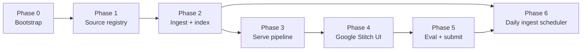

# Implementation Plan: Mutual Fund FAQ Assistant

Phase-wise build plan for the facts-only RAG assistant. Derived from [`Architecture.md`](./Architecture.md) and [`problemStatement.md`](./problemStatement.md).

**Design principle:** accuracy over intelligence. Closed corpus at answer time. No advice, no return math, no PII.

**Primary source: Groww scheme URLs.** Dual ingest still includes SBI KIM/SID PDFs and other official pages, but Groww is first in the registry, first in ingest, first in retrieval ranking, and first in citations.

| Role | Source |
| --- | --- |
| **Primary** | Five Groww scheme pages (`groww.in/mutual-funds/...`) |
| Supporting | SBI KIM/SID PDFs (cite `sbimf.com`) |
| Supporting | Shared SBI / AMFI / SEBI pages (15–25 URL total) |

This plan **overrides Architecture §8** citation rank: Groww scheme page → SBI KIM/SID/factsheet/TER → AMFI/SEBI. Use SBI only when the fact is missing from retrieved Groww chunks, or for refusals/education/performance-link-only cases.

**Current baseline (as of plan write-up):**

| Item | Status |
| --- | --- |
| Docs (`problemStatement`, `Architecture`) | Done |
| `docs/corpus/kim/` + `sid/` (10 PDFs) | Present (supporting) |
| `docs/corpus/groww/` | Not started (primary) |
| `docs/corpus/factsheets/`, `shared/` | Empty placeholders |
| `src/ingest/`, `src/serve/` | Empty directories |
| `data/chroma/` | Placeholder |
| `docs/sources.md`, code, UI, README | Not started |

---

## Overview



| Phase | Goal | Exit when |
| --- | --- | --- |
| 0 | Project skeleton and config | App layout, deps, disclaimer, `.env` template exist |
| 1 | Curate 15–25 sources, **Groww first** | `docs/sources.md` (+ CSV) complete; Small Cap naming decided |
| 2 | Dual ingest → Chroma, **Groww HTML first** | Groww HTML + PDFs + shared pages chunked and embedded |
| 3 | Facts-only chat API, **cite Groww by default** | `POST /chat` returns validated answers or refusals |
| 4 | Minimal UI via **Google Stitch** | Welcome, 3 examples, disclaimer, ask box |
| 5 | Deliverables | Prototype/demo, sample Q&A, README, source list |
| 6 | **Daily GitHub Actions ingest scheduler (17:30 SGT)** | Cron runs scrape → normalize → chunk → embed → Chroma update every day |

**Stack (locked):** Python 3.11+, Groq, sentence-transformers, Chroma, FastAPI, Google Stitch design → React (Vite) in `ui/`, pdfplumber/pypdf, httpx + BeautifulSoup.

This plan **overrides Architecture §7.1 / §14:** the UI is a **Google Stitch** design implemented as a **React (Vite)** app in `ui/`, served by FastAPI from `ui/dist` (or Vercel for the frontend). Design source: `stitch_sbi_mutual_fund_faq_assistant/`.

---

## Phase 0 — Bootstrap

**Goal:** Make the repo runnable and match the architecture layout before any ingest logic. Treat `docs/corpus/groww/` as the primary corpus folder.

### Tasks

1. Create missing paths:
   - `docs/corpus/groww/` **(primary ingest snapshots)**
   - `disclaimer.txt` (must include: `Facts-only. No investment advice.`)
   - `src/ingest/__init__.py`, `src/serve/__init__.py`
   - `scripts/` helpers stubs as needed
2. Add `requirements.txt` (or `pyproject.toml`) with: FastAPI, uvicorn, chromadb, sentence-transformers, httpx, beautifulsoup4, pdfplumber, pypdf, python-dotenv, groq. Phase 4 UI is Google Stitch + static files in `ui/` (no separate Python UI framework).
3. Add `.env.example` with `GROQ_API_KEY=` and model name (e.g. `llama-3.1-8b-instant`). Add `.env` to `.gitignore`.
4. Add a minimal `README.md` stub (setup TBD in Phase 5; link Architecture + this plan). State that Groww scheme URLs are the primary source.
5. Confirm `.venv` can install deps and import chromadb / sentence_transformers / groq.

### Deliverables

- [x] `disclaimer.txt`
- [x] `.env.example` + gitignored `.env`
- [x] Dependency file
- [x] Directory tree matching Architecture §15, with `docs/corpus/groww/` present

### Acceptance criteria

- Fresh clone + venv + `pip install -r requirements.txt` succeeds.
- No secrets committed.
- Disclaimer string matches problem-statement wording.
- Primary corpus path `docs/corpus/groww/` exists.

### Dependencies / notes

- Does not block Phase 1 registry writing (can run in parallel), but blocks Phase 2–4 code.

---

## Phase 1 — Source registry and corpus completion

**Goal:** Publish the **15–25 URL** source list with **Groww as primary sources #1–5**, then supporting SBI/AMFI/SEBI rows. Decide scheme identity for Small Cap vs Groww `small-midcap`.

**Registry order (must follow):** **Groww URLs first (primary)** → SBI KIM/SID PDFs (supporting) → shared official pages (supporting).

### Tasks

1. Create `docs/sources.md` (and optionally `docs/sources.csv`) with the Architecture §6.2 schema:
   - `source_id`, `url`, `publisher`, `doc_type`, `scheme`, `local_path`, `retrieved_on`, `priority`
   - Rows must be ordered so **Groww scheme URLs are sources #1–5** (first block in the file).
2. **Primary sources — register 5 Groww scheme URLs** (`publisher=GROWW`, `doc_type=groww_scheme`, **`priority=1`**):
   - https://groww.in/mutual-funds/sbi-large-cap-direct-plan-growth
   - https://groww.in/mutual-funds/sbi-flexicap-fund-direct-growth
   - https://groww.in/mutual-funds/sbi-elss-tax-saver-fund-direct-growth
   - https://groww.in/mutual-funds/sbi-contra-fund-direct-growth
   - https://groww.in/mutual-funds/sbi-small-midcap-fund-direct-growth
3. **Supporting — register 10 SBI KIM/SID PDFs** already on disk; set `url` to matching `sbimf.com` PDF or hub `https://www.sbimf.com/offer-document-sid-kim` (`publisher=SBI`, **`priority=2`**).
4. **Supporting — register shared official pages** to reach ≥15 (prefer ~20), **`priority=3`** unless the page is a scheme factsheet used only as fallback:
   - https://www.sbimf.com/
   - https://www.sbimf.com/offer-document-sid-kim
   - https://www.sbimf.com/factsheets/
   - https://www.sbimf.com/total-expense-ratio/
   - https://www.amfiindia.com/investor
   - Optional: SEBI riskometer, SBI statement/tax guides, per-scheme factsheet PDFs into `docs/corpus/factsheets/`
5. **Naming check:** confirm on sbimf.com whether Groww `sbi-small-midcap-fund-direct-growth` equals **SBI Small Cap Fund**. Document the decision in `sources.md`. Until confirmed, keep separate scheme tags (`groww_small_midcap` vs `sbi_small_cap`) and **answer from the Groww-tagged chunks** for that Groww URL.
6. Document safe aliases only: Bluechip → Large Cap; Long Term Equity → ELSS Tax Saver.

### Deliverables

- [x] `docs/sources.md` with **15–25** public URLs (**Groww URLs listed first, `priority=1`**) — **22 URLs**
- [x] Optional `docs/sources.csv` (submit-friendly; same row order)
- [x] Naming decision note for Small Cap / Small Midcap (**confirmed same scheme; merged to `sbi_small_cap`**)
- [x] Factsheet/shared pages downloaded or clearly listed as Phase 2 fetch targets

### Phase 1 task status

| Task | Status |
| --- | --- |
| 1.1 Schema + Groww-first `sources.md` | Done |
| 1.2 Register 5 Groww URLs | **Done** — Block A in `sources.md` / `sources.csv`; HTTP 200 verified |
| 1.3 Register 10 SBI KIM/SID | **Done** — Block B in `sources.md` / `sources.csv`; cite sbimf.com PDF URLs |
| 1.4 Register shared official pages | **Done** — Block C; 7 shared URLs; total **22** citeable |
| 1.5 Naming check | **Confirmed** — Groww small-midcap slug = SBI Small Cap Fund |
| 1.6 Safe aliases | **Confirmed** — Bluechip→Large Cap; Long Term Equity→ELSS; Small & Midcap→Small Cap |

### Acceptance criteria

- Source list sequence starts with the **five Groww URLs** as the **primary** block.
- Groww rows use `priority=1`; SBI PDF rows use `priority=2`.
- Every row has a public `url` (never a bare local path as citation).
- Hosts only: `groww.in` (five paths), `sbimf.com`, `amfiindia.com`, `sebi.gov.in` / `investor.sebi.gov.in`.
- Exactly one AMC (SBI) and 3–5 schemes (five) in scope.
- Count of citeable URLs is in **15–25**.

### Dependencies / notes

- Groww URLs are the primary registry block; HTML fetch for those URLs is the **first** ingest step in Phase 2.
- 10 PDFs already on disk cover the supporting registry block.

---

## Phase 2 — Dual ingest, parse, chunk, embed

**Goal:** Build the offline corpus with **Groww HTML as the primary ingest path**, then SBI PDFs and shared pages → Chroma at `data/chroma/`.

### Tasks

1. **`src/ingest/fetch.py`** — run adapters in this order:
   - **Primary — Groww adapter first:** HTTP GET the five allowlisted scheme URLs → `docs/corpus/groww/{slug}.html`; stamp `retrieved_on`. Fail the build if any of the five Groww fetches fail (do not silently index PDFs-only).
   - Supporting — PDF adapter: register existing `kim/` and `sid/` files from registry (no re-download required).
   - Supporting — Official HTML adapter: fetch shared registry rows into `docs/corpus/shared/` (and factsheets if listed).
   - Reject hosts outside the allowlist.
2. **`src/ingest/parse.py`**
   - **Groww HTML first:** BeautifulSoup; main content only; drop nav/ads/related carousels. Extract labelled product facts (TER, min SIP, exit load, riskometer, category).
   - PDF: pdfplumber (tables) + pypdf fallback (supporting fill-in).
   - Apply safe aliases; do not merge Small Cap / Small Midcap unless Phase 1 confirmed.
3. **`src/ingest/chunk.py`**
   - Chunk **Groww pages first**, then KIM/SID (heading-aware where possible); else ~500–800 tokens, 10–15% overlap.
   - Attach metadata: `url`, `scheme`, `doc_type`, `publisher`, `section_title`, `retrieved_on`, `priority`, `local_path` (ingest-only).
   - Groww chunks: `priority=1`. SBI chunks: `priority=2`.
4. **`src/ingest/embed.py`**
   - Local sentence-transformers; same model at query time.
   - Persist to Chroma under `data/chroma/`.
   - Optional hybrid keyword boost for `exit load`, `SIP`, `lock-in`, `TER`, scheme names.
5. Add `scripts/build_index.py` (or `python -m src.ingest...`) as the single offline entrypoint. Default path: Groww → PDFs → shared.
6. Smoke-test: query store for “ELSS lock-in” and “exit load Flexicap”; expect **Groww chunks with `priority=1`** in the top results (SBI chunks may also appear at `priority=2`).

### Deliverables

- [x] Working ingest modules + index build script (**Groww fetch is required**) — `python scripts/build_index.py` (or `python -m src.ingest`)
- [x] `docs/corpus/groww/` HTML snapshots for all five schemes
- [x] Populated `data/chroma/` — ~195 chunks after quality pass (`mf_faq_chunks`, jina-embeddings-v2-base-en; was 586)
- [x] Log/summary of documents ingested and chunk counts by `publisher` (Groww count must be non-zero) — see `data/chroma/embed_manifest.json` (Groww=34)

### Acceptance criteria

- **All five Groww pages ingested** before treating the index as complete.
- Supporting SBI chunks exist for each in-scope scheme (Small Cap caveat as decided).
- Every chunk has a public citation `url`.
- Rebuild is deterministic from `docs/sources.md` + local files.
- No live browsing required at answer time after index build.

### Dependencies / notes

- Requires Phase 0 deps and Phase 1 registry.
- Retrieval ranking must encode **Groww primary** via `priority=1` metadata now.

### Phase 2 task status

| Task | Status |
| --- | --- |
| 2.1 `fetch.py` Groww → PDFs → shared | **Done** — run `python scripts/fetch_corpus.py` |
| 2.2 `parse.py` | **Done** — run `python scripts/parse_corpus.py --skip-missing` |
| 2.3 `chunk.py` | **Done** (+ quality pass: merge Groww micro-chunks, cap SID/KIM windows, hub-only shared pages) — `python scripts/chunk_corpus.py` → `data/chunks.jsonl` |
| 2.4 `embed.py` | **Done** — run `python scripts/embed_corpus.py` (optional `--smoke`) |
| 2.5 `build_index.py` | **Done** — `python scripts/build_index.py` (Groww → PDFs → shared → parse → chunk → embed). Reuse snapshots: `--skip-fetch`. Alias: `python -m src.ingest` |
| 2.6 Smoke-test | **Done** (via `embed_corpus.py --smoke`) — Groww in top hits for ELSS lock-in & Flexicap exit load |

---

## Phase 3 — Serve pipeline (classify → retrieve/refuse → generate → validate)

**Goal:** Implement the online facts-only chat API per Architecture §§7–12, with **Groww as the default citation**.

### Tasks

1. **`src/serve/classify.py`** — intents: `factual`, `process_howto`, `performance`, `advisory`, `comparative`, `pii`, `out_of_scope`. Rules-first for advisory/PII (PAN, Aadhaar, account, OTP, email, phone).
2. **`src/serve/refuse.py`** — polite facts-only refusal + one AMFI/SEBI (or factsheet) educational URL; still ≤3 sentences + footer. (Refusals are the main case that may skip Groww.)
3. **`src/serve/retrieve.py`** — scheme filter + top-k ~4–6; search Groww + SBI; **re-rank by `priority` then similarity so Groww (`priority=1`) ranks above SBI**; require at least one Groww chunk when a named in-scope scheme matches; low-score → “not in corpus” + **that scheme’s Groww URL**.
4. **`src/serve/generate.py`** — Groq; context = retrieved chunks only; **prefer one Groww URL**; use SBI URL only if Groww chunks do not contain the fact; no advice/comparisons/return math.
5. **`src/serve/validate.py`** — enforce ≤3 sentences; exactly one allowlisted `Source:`; `Last updated from sources: YYYY-MM-DD`; no local paths; no PII echo; block invented returns. For factual scheme Qs, **prefer `groww.in` host**.
6. **`src/serve/api.py`** — FastAPI `POST /chat` with body `{ "question": "..." }` only; response shape per Architecture §12.
7. Wire logging: request id, intent, latency, validator result, source **host** — never raw PII queries.

### Retrieval strategy (corpus-aware, implemented)

Code: `src/serve/retrieve.py` + `src/ingest/embed.py::query_chunks` + citation logic in `src/serve/pipeline.py`.  
Corpus snapshot: `data/chunks.jsonl` → Chroma `mf_faq_chunks` (**195** chunks after Phase 2 quality pass).

#### What the index actually contains

| Slice | Count | Role in retrieval |
| --- | ---: | --- |
| Groww `Scheme Facts` | **5** (1 per scheme) | **Primary FAQ evidence** — short labelled fields (~40–60 words): Category, Expense Ratio, Min Sip, Min Lumpsum, Exit Load, Lock In (ELSS only), Riskometer, Benchmark, AUM |
| Groww `full_document` | **29** | Coverage windows (~650 words). Mix of useful “About” text (**Latest NAV**, objective) and **noise** (portfolio holdings e.g. Bharat Forge, return tables, compare-fund chrome, site nav) |
| SBI named sections (KIM/SID) | **~75** | Supporting fill-in: Exit Load, Expense Ratio, Minimum Investment, Lock-in, Benchmark, Objective, Asset Allocation, Risk Factors |
| SBI `full_document` | **80** | Capped SID/KIM windows; denser legalese — use only when named sections / Groww lack the field |
| Shared `Hub Overview` | **5** | Thin SBI hub pages (factsheet / TER / statement / home) — for `process_howto` / “where to look”, not scheme numbers |
| AMFI education | **1** | Refusal / education fallback |

**Publisher mix:** GROWW 34 (`priority=1`) · SBI 160 (`priority=2`) · AMFI/shared 6 (`priority=3`).  
SBI volume ≫ Groww, so retrieval **must** re-rank by `priority` or SID noise will dominate.

**Field placement (important):**

| FAQ field | Best chunk type | Notes |
| --- | --- | --- |
| Exit load, TER, min SIP/lumpsum, lock-in, riskometer, benchmark, AUM | Groww **`Scheme Facts`** | Not duplicated as separate Groww micro-sections (merged at chunk time) |
| Latest NAV (+ as-of date) | Groww **`full_document`** “About” window | **Not** in Scheme Facts today |
| Portfolio holdings / stock names | Groww `full_document` | Noise for FAQ — do not treat as answer targets |
| Trailing returns / rankings on Groww | Groww `full_document` | Present in HTML but **performance intent refuses** — do not quote |
| Process / “download statement” | Shared **`Hub Overview`** | Prefer over scheme SID text |

#### When retrieval runs

Only intents **`factual`** and **`process_howto`**.  
Advisory / comparative / performance / PII / out_of_scope → `refuse.py` (no Chroma).

#### Online steps

| Step | What happens | Why (given this corpus) |
| --- | --- | --- |
| 1. Scheme detect | Map question → `scheme_tag` via aliases | Each scheme has ~37–38 chunks; filter cuts cross-scheme SID bleed |
| 2. Vector search | Same embedder as ingest (`jina-embeddings-v2-base-en`); Chroma over-fetch ~2× top-k | Dense search over mixed Facts + noisy full windows |
| 3. Metadata filter | `where={"scheme_tag": …}` when known; empty → retry unfiltered | Keeps Flexicap questions off Contra SID pages |
| 4. Hybrid keyword boost | Chunk metadata keywords (`exit_load`, `sip`, `lock_in`, `ter`, …) | Helps surface **Scheme Facts** / named SBI sections over holdings lists |
| 5. Re-rank | **`priority` first** (1→2→3), then combined similarity | Counteracts 160 SBI vs 34 Groww imbalance |
| 6. Groww guarantee | If scheme named, promote Groww hits into the candidate list | Ensures Facts / Groww full enter top-k when present |
| 7. Field preference | Soft-prefer chunks mentioning the asked field | Pulls `Scheme Facts` / `Exit Load` section ahead of `full_document` portfolio noise |
| 8. Intent tweak | `process_howto` soft-prefer `doc_type=hub` / shared | Hubs are the only useful process pages in-index |
| 9. Top-k | Keep **≈5** chunks for Groq | Enough for Facts + 1–2 supporting SBI sections without flooding context |
| 10. Low-score gate | Best score &lt; **0.42** → not-in-corpus + scheme **Groww URL** | No invented TER/NAV from empty/weak hits |
| 11. Citation | Cite **Groww** if any retrieved Groww chunk has the field; else SBI URL; never `local_path` | Matches Architecture conflict rule; Facts usually win for FAQ fields |

```text
question
  → classify (intent + scheme_tag?)
  → refuse intents ──────────────────────────────► validate
  → factual / process
       → embed query → Chroma (scheme_tag filter)
       → keyword boost + priority-first re-rank
       → promote Groww; prefer field-matching sections
       → (process) prefer hub chunks
       → top-k = 5
       → score < 0.42? → not_in_corpus + Groww URL
       → else Groq(context only) → validate
```

#### Retrieval implications / known limits

- Prefer **`section_title=Scheme Facts`** evidence for TER / SIP / exit load / lock-in; treat Groww **`full_document`** as secondary (NAV / objective) and noisy (holdings, compare widgets).
- **Do not** answer stock-holding questions from portfolio rows (e.g. Bharat Forge) even if retrieved.
- **Do not** answer return/CAGR questions via retrieval — classifier → performance refusal (factsheet hub), even though return tables exist in Groww full chunks.
- NAV questions rely on Groww full windows until NAV is added to Scheme Facts at parse time.
- Shared hubs cannot answer scheme TER tables; they only point at official hubs.

**Out of scope for retrieval:** live web; Groww-only publisher filter (SBI stays eligible as fill-in); citing filesystem paths.

### Deliverables

- [x] FastAPI app with `POST /chat` — `python scripts/run_api.py` or `uvicorn src.serve.api:app`
- [x] Classifier + refusal + retrieve + generate + validate modules under `src/serve/`
- [x] Manual curl/httpx smoke tests for fact and refusal paths — `python scripts/smoke_chat.py`

### Acceptance criteria

| Scenario | Expected |
| --- | --- |
| “Exit load of SBI Flexicap?” | Factual ≤3 sentences, **one Groww scheme URL as Source** (SBI only if Groww text lacks the fact), last-updated footer |
| “Should I buy SBI Contra?” | Refusal + educational link; no recommendation |
| “Which is better, Large Cap or Flexicap?” | Comparative refusal |
| “What was the 3-year return?” | Performance refusal; factsheet/official link only (not a Groww return chart number) |
| Question containing PAN/phone | PII refusal; not logged raw |
| Empty body | `400 question_required` |

### Phase 3 task status

| Task | Status |
| --- | --- |
| 3.1 `classify.py` | **Done** |
| 3.2 `refuse.py` | **Done** |
| 3.3 `retrieve.py` | **Done** — Groww-ranked via `priority` then score |
| 3.4 `generate.py` | **Done** — Groq (`GROQ_MODEL`, default `openai/gpt-oss-120b`) + extractive fallback; min tokens via `GROQ_REASONING_EFFORT=low`, `GROQ_MAX_TOKENS=256`, `GROQ_CONTEXT_CHUNKS=3`, `GROQ_CONTEXT_CHARS=480` (fits ~8K TPM) |
| 3.5 `validate.py` | **Done** |
| 3.6 `api.py` `POST /chat` | **Done** |
| 3.7 Logging (request id, intent, latency, host) | **Done** — PII queries redacted |

### Dependencies / notes

- Requires Phase 2 index (including Groww HTML) and `GROQ_API_KEY`.
- Generator must never receive `local_path` as the citation field shown to users.
- Groww vs SBI conflict: **answer and cite Groww**.
- Default Groq model: `GROQ_MODEL=openai/gpt-oss-120b`. Min tokens/call under 30 RPM / 8K TPM: `GROQ_REASONING_EFFORT=low`, `GROQ_MAX_TOKENS=256` (covers gpt-oss CoT + ≤3 sentences), max 3 chunks × 480 chars. Typical call ~0.6–0.9K tokens.

---

## Phase 4 — Google Stitch UI

**Goal:** Meet problem-statement UI constraints (welcome, three examples, visible disclaimer) with a **Google Stitch design** implemented as a **React (Vite) frontend** and served by FastAPI. Frame the product as a **Groww-scheme FAQ** backed by supporting SBI documents.

### Tasks

1. Generate the UI in [Google Stitch](https://stitch.withgoogle.com) using [`docs/stitch-prompt-phase4.md`](./stitch-prompt-phase4.md). Keep the Stitch export under `stitch_sbi_mutual_fund_faq_assistant/` (HTML + DESIGN.md).
2. Implement that design as a React app in `ui/` (Vite + Tailwind). Preserve Stitch tokens (paper background, teal Ask, amber disclaimer).
3. Serve `ui/dist` from FastAPI after `npm run build` (static mount + `/` → `index.html`). During UI work, `npm run dev` proxies `/chat` to the API. The Ask control must call existing `POST /chat` with body `{ "question": "..." }` only (same contract as Architecture §12).
4. UI elements (must match Stitch prompt + problem statement):
   - Title / welcome: **facts from Groww scheme pages** (SBI KIM/SID used as supporting corpus)
   - Persistent disclaimer banner: **Facts-only. No investment advice.** (copy from `disclaimer.txt`)
   - Three example chips: expense ratio (Large Cap), ELSS lock-in, min SIP (Flexicap) — prefill and submit
   - Textarea + Ask
   - Render `answer`, single clickable `source` (Groww by default), `last_updated_from_sources`
5. Wire UI states: empty, loading, factual answer, refusal, empty-question error (`400 question_required`).
6. No login, KYC, PAN, email, or phone fields. Do not send extra JSON keys the API does not need.

### Deliverables

- [x] Stitch prompt checked in at `docs/stitch-prompt-phase4.md`
- [x] Stitch design in `stitch_sbi_mutual_fund_faq_assistant/` ported to React in `ui/`
- [x] FastAPI serves the UI locally (open `/` after `npm run build`; Ask hits `/chat`)
- [ ] Screenshot or short clip of first screen (optional, helps Phase 5 demo)

### Phase 4 task status

| Task | Status |
| --- | --- |
| 4.1 Google Stitch prompt | **Done** — `docs/stitch-prompt-phase4.md` |
| 4.2 Stitch design → React in `ui/` | **Done** — Vite + Tailwind; source `stitch_sbi_mutual_fund_faq_assistant/` |
| 4.3 Serve `ui/dist` from FastAPI; Ask → `POST /chat` | **Done** |
| 4.4 States: empty / loading / answer / refusal / empty error | **Done** |
| 4.5 Google Stitch UI wired to `POST /chat` | **Done** |

### Acceptance criteria

- Disclaimer visible without scrolling on a normal laptop viewport.
- Example questions prefill/submit and return cited answers **with Groww URLs when the fact is on the scheme page**.
- UI never shows filesystem paths as sources.
- Only `question` is sent to the backend.
- Google Stitch UI served from `ui/dist` (FastAPI) or Vercel; Ask calls `POST /chat`.

### Dependencies / notes

- Requires Phase 3 API.
- Keep layout minimal; one job: ask a factual FAQ.
- Stitch is design + markup only (`stitch_sbi_mutual_fund_faq_assistant/`). Retrieval, refusals, and citations stay in `src/serve/`. The runnable UI is React in `ui/`.

---

## Phase 5 — Evaluation, docs, and submission pack

**Goal:** Satisfy problem-statement deliverables and success criteria, with **Groww as the primary cited source** in sample Q&A.

### Tasks

1. **Eval checklist** (run and record results):
   - Facts: expense ratio, exit load, min SIP, ELSS lock-in, riskometer/benchmark, statement-download howto
   - Factual scheme answers **cite `groww.in`** unless the field is absent from Groww snapshots
   - Refusals: advisory, comparative, performance-compute, PII
   - Citation host allowlisted every time
2. Write **`docs/sample_qa.md`** with **5–10** Q&A pairs (assistant answers + citation links). **Most factual pairs should cite the matching Groww scheme URL.**
3. Finalize **`README.md`**:
   - Setup (venv, `.env`, install, **fetch Groww then** build index, run API, open the Stitch UI at `/`)
   - Scope (SBI Mutual Fund + five schemes; **Groww URLs are primary**)
   - Known limits (refusals, citation preference **Groww > SBI**, Small Cap naming, incomplete factsheets if any)
4. Confirm **`docs/sources.md` / CSV** is the submit source list (15–25 URLs), Groww block first.
5. Confirm **`disclaimer.txt`** matches UI.
6. Ship **working prototype** (hosted URL) **or** ≤3-min demo video if hosting is not possible.
7. Optional: scripted eval under `scripts/eval_questions.json` for regression.

### Deliverables (submission)

| # | Deliverable | Path / artifact |
| ---: | --- | --- |
| 1 | Working prototype or ≤3-min demo | Hosted link or video |
| 2 | Source list (15–25 URLs, Groww first) | `docs/sources.md` / CSV |
| 3 | README (setup, scope, known limits) | `README.md` |
| 4 | Sample Q&A (5–10) | `docs/sample_qa.md` |
| 5 | Disclaimer snippet | `disclaimer.txt` + UI |

### Acceptance criteria (success criteria mapping)

| Success criterion | How Phase 5 proves it |
| --- | --- |
| Accurate factual retrieval | Sample Q&A + eval pass on expense/exit/SIP/lock-in **from Groww pages** |
| Facts-only, no advice | Advisory/comparative eval cases refuse |
| Valid citations | Every sample answer has one allowlisted URL; **factual scheme Qs prefer Groww** |
| Proper refusals + educational link | Documented in sample Q&A |
| Clean minimal UI | Disclaimer + 3 examples verified |

### Dependencies / notes

- Do not claim full coverage for factsheet/TER/statement FAQs until those pages are ingested.
- Prefer **Groww** citations in sample answers when both sources exist.

---

## Phase 6 — Daily ingest scheduler (GitHub Actions)

**Goal:** Keep the corpus fresh without manual rebuilds. A **GitHub Actions cron** runs **once every day at 17:30 Singapore Time (SGT)**, re-running the Phase 2 ingest pipeline end-to-end so scrape → normalize → chunk → embed → Chroma always reflect the latest allowlisted pages (especially Groww NAV / TER / exit-load fields).

**Scheduler = GitHub Actions only** (no local cron daemon, no APScheduler in the FastAPI process). Answer-time serving stays offline against the last built index; freshness comes from this daily job.

### Pipeline the workflow must run (same order as Phase 2)

| Step | Component | Command / module | Output |
| --- | --- | --- | --- |
| 1. Scrape / fetch | `src/ingest/fetch.py` | HTTP GET Groww (required) → shared HTML; register local KIM/SID PDFs | `docs/corpus/groww/`, `docs/corpus/shared/`, stamped `retrieved_on` |
| 2. Normalize / parse | `src/ingest/parse.py` | BeautifulSoup + pdfplumber; extract Scheme Facts / sections | Parsed docs for chunking |
| 3. Chunk | `src/ingest/chunk.py` | Groww-first chunking + metadata (`url`, `priority`, `retrieved_on`, …) | `data/chunks.jsonl` |
| 4. Embed | `src/ingest/embed.py` | `jinaai/jina-embeddings-v2-base-en` | Vectors |
| 5. Update ChromaDB | embed write path | Rebuild / replace collection `mf_faq_chunks` under `data/chroma/` | Fresh index + `data/chroma/embed_manifest.json` |

**Single entrypoint:** `python scripts/build_index.py` (alias `python -m src.ingest`). The daily job **never** uses `--skip-fetch`.

```text
GitHub Actions (cron: 17:30 SGT / 09:30 UTC daily)
  → checkout repo
  → setup Python 3.11 + pip install -r requirements.txt
  → python scripts/build_index.py --smoke
       → scrape (Groww first, then shared; PDFs from registry; HTTP retries)
       → normalize / parse
       → chunk
       → embed
       → write / replace Chroma collection
  → write Actions job summary (scripts/ingest_job_summary.py)
  → upload data/chroma/ artifact (chroma-index-<run_id>)
  → bot-commit Groww/shared HTML + chunks.jsonl + embed_manifest + sources.csv
  → fail the job if any of the five Groww fetches fail
```

### Tasks

1. **Add workflow** `.github/workflows/daily-ingest.yml`:
   - Trigger: `schedule` cron **`30 9 * * *`** (09:30 UTC = **17:30 SGT**) **and** `workflow_dispatch` for manual runs.
   - Runner: `ubuntu-latest`.
   - Steps: checkout → setup-python → cache pip / HF model → `pip install -r requirements.txt` → `python scripts/build_index.py --smoke`.
2. **Make ingest CI-safe:**
   - Polite delays + **HTTP retries** on Groww + shared fetches (`src/ingest/fetch.py`).
   - Fail hard if any primary Groww URL fails (same rule as Phase 2).
   - Log chunk counts by `publisher` into the job summary / `embed_manifest.json`.
3. **Persist daily outputs** (strategy A):
   - Bot-commit trackable refreshes: `docs/corpus/groww/*.html`, `docs/corpus/shared/*.html`, `data/chunks.jsonl`, `data/chroma/embed_manifest.json`, `docs/sources.csv`.
   - Upload full `data/chroma/` as workflow artifact `chroma-index-<run_id>` (14-day retention).
   - Never commit `.env` / `GROQ_API_KEY` (ingest does not need Groq).
4. **Local / deploy refresh:** `python scripts/pull_latest_chroma.py` downloads the latest successful artifact into `data/chroma/`; restart API.
5. **Observability:** Actions failure notifications (default); success summary via `scripts/ingest_job_summary.py` (date, publisher counts, `retrieved_on`).
6. **README** section: “Daily corpus refresh (GitHub Actions)” with schedule, manual dispatch, and pull instructions.

### Deliverables

- [x] `.github/workflows/daily-ingest.yml` (cron 17:30 SGT + manual dispatch)
- [x] Daily job runs full `build_index.py` (scrape → parse → chunk → embed → Chroma)
- [x] Persistence: Chroma artifact + bot commit of HTML/chunks/manifest; documented in README
- [x] README section: “Daily corpus refresh (GitHub Actions)”
- [ ] First successful scheduled or manually dispatched run on GitHub (after merge to default branch)

### Phase 6 task status

| Task | Status |
| --- | --- |
| 6.1 Workflow YAML (`cron` 17:30 SGT + `workflow_dispatch`) | **Done** — `.github/workflows/daily-ingest.yml` |
| 6.2 CI-safe fetch retries + Groww-required fail | **Done** — retries in `fetch.py`; Groww fail-hard unchanged |
| 6.3 Persist corpus / Chroma after build | **Done** — artifact + bot commit |
| 6.4 Document API refresh from latest index | **Done** — `scripts/pull_latest_chroma.py` + README |
| 6.5 Job summary + failure alerts | **Done** — `scripts/ingest_job_summary.py` |
| 6.6 README daily-ingest section | **Done** |

### Acceptance criteria

- Workflow runs **every day at 17:30 SGT** without manual intervention (plus manual dispatch works).
- Each successful run **re-scrapes** allowlisted Groww + shared pages, **re-normalizes**, **re-chunks**, **re-embeds**, and **updates Chroma** (`mf_faq_chunks`).
- All five Groww scheme pages are present in the new index; Groww chunk count &gt; 0.
- Chunk metadata `retrieved_on` / manifest date matches the run day.
- Failed Groww scrape fails the Actions job (no silent stale PDFs-only “success”).
- No secrets required for ingest; no live browsing added to `POST /chat`.

### Dependencies / notes

- Depends on Phase 2 ingest modules and `scripts/build_index.py`.
- Independent of Groq / Phase 3 generation (scheduler only refreshes the retrieval corpus).
- Can land after Phase 5 submission, or in parallel once Phase 2 is stable.
- Respect site ToS / rate limits: allowlisted hosts only; polite User-Agent + delays + retries.
- Scheduled workflows only run on the **default branch**; keep the YAML on `main`.
- Cron is authored in **UTC** (`30 9 * * *`); wall clock is **17:30 SGT**.

---

## Cross-cutting rules (all phases)

1. **Cite `url`, ingest `local_path`.** Never show `docs/corpus/...` to users.
2. **Primary source is Groww.** Citation preference: **Groww scheme page → SBI KIM/SID/factsheet/TER → AMFI/SEBI.**
3. **One AMC, five schemes** only; no other Groww funds. Only the five listed Groww paths may be ingested from `groww.in`.
4. **Response contract:** ≤3 sentences; one Source; `Last updated from sources:`; disclaimer in UI.
5. **No PII** storage, logging of raw PII queries, or request for sensitive data.
6. **Performance questions:** do not quote Groww return charts; link official factsheet only; no computed or compared returns.
7. **Groww vs SBI conflict:** **answer from Groww; cite Groww.** Use SBI when Groww does not contain the field.

---

## Suggested order of work (checklist)

```text
[x] Phase 0  Bootstrap (layout, deps, disclaimer, .env, docs/corpus/groww/)
[x] Phase 1  sources.md: Groww URLs first (priority=1), then SBI, then shared
[x] Phase 2  fetch Groww first + parse PDFs/HTML + embed Chroma
[x] Phase 3  classify / refuse / retrieve (Groww-ranked) / generate / validate / FastAPI
[x] Phase 4  Google Stitch UI → React in `ui/` (Groww-primary welcome)
[ ] Phase 5  sample_qa (Groww citations), README, eval, prototype/demo, submit
[x] Phase 6  GitHub Actions daily ingest @ 17:30 SGT: scrape → normalize → chunk → embed → Chroma
```

**Parallelism tip:** Phase 1 registry can start while Phase 0 deps install. Phase 5 sample questions can be drafted during Phase 3 once the API is stable. Phase 6 can start as soon as Phase 2 `build_index.py` is reliable (does not need Groq).

---

## Risk watchlist during implementation

| Risk | When it shows up | Action |
| --- | --- | --- |
| Groww HTML layout brittle | Phase 2 fetch/parse | Re-fetch snapshots; **Groww is primary**, so parser must be maintained; SBI PDFs are fallback only |
| Groww fetch blocked / rate-limited | Phase 2 | Retry with polite delay; do not ship a PDFs-only index as “complete” |
| PDF tables poorly extracted | Phase 2 parse | pdfplumber; keep raw table lines in chunks (supporting only) |
| Small Cap ≠ Small Midcap | Phase 1–2 | Keep separate tags; **serve the Groww `small-midcap` page as primary** for that URL |
| Groq invents numbers | Phase 3 generate/validate | Chunks-only prompt; validator blocks |
| Missing factsheets/TER/statements | Phase 1–2 | Fetch before claiming those FAQ types (usually not on Groww scheme snapshot) |
| Stitch export is visual-only | Phase 4 | Wire Ask to `POST /chat`; map `answer` / `source` / `last_updated_from_sources`; implement in React `ui/` |
| Hosted deploy hard | Phase 5 | Ship FastAPI (Railway) + Google Stitch UI on Vercel **or** ≤3-min demo video |
| Groww fetch blocked / flaky in CI | Phase 6 | Retries + polite delay; fail job if Groww required pages fail; alert on Actions failure |
| Chroma gitignored → stale deploy index | Phase 6 | Persist via Actions artifact and/or bot-commit branch; document how API pulls latest `data/chroma/` |
| Cron only on default branch | Phase 6 | Merge workflow to `main`; use `workflow_dispatch` for branch testing |

---

## Summary

Implement in seven phases (0–6): **bootstrap → source registry → dual ingest/index → constrained chat API → Google Stitch UI → submission pack → daily GitHub Actions ingest scheduler**.

**Groww scheme URLs are the primary source** for registry order, ingest, retrieval ranking, default citations, sample Q&A, and README scope. SBI KIM/SID PDFs and AMFI/SEBI pages are supporting corpus. The assistant stays facts-only with validated short answers and refusals for advice, comparisons, performance math, and PII. **Phase 6** keeps that corpus current by re-running scrape → normalize → chunk → embed → Chroma **every day** via GitHub Actions (no live browse at answer time).
